# AlgoStakeX SDK

**Staking on Algorand shouldn't take months to build.**

AlgoStakeX is the plug-and-play SDK that brings enterprise-grade token staking to any Algorand dApp in minutes—**one configuration, infinite use cases.**

[](https://opensource.org/licenses/MIT)
[](https://algorand.com)

## 🔗 Live Links

- **Smart Contract (Testnet):** https://lora.algokit.io/testnet/application/749429587
- **Analytics Dashboard:** https://algostakex.ibhagyesh.site/

---

## ✨ Features

- ✅ **First standardized staking SDK for Algorand**
- ⚡ **Eliminates months of development time** (from 2-3 months to minutes)
- 🪙 **Works with any Algorand Standard Asset (ASA/FT)**
- 💾 **Single box storage optimization** (66% cost reduction)
- 🔥 **No pool creation overhead** (dynamic staking on-demand)
- 🧪 **No smart contract writing required** — pre-audited smart contract ready to use
- 🎓 **No blockchain expertise required**
- ✅ Works on **Testnet** and **Mainnet**
- 🧭 **Minimal, user-friendly UI** with SDK minimization support
- ⚡ **Real-time event emitter** for frontend event handling
- 🔔 **Customizable toast notifications**
- 🎨 **Customizable UI** with logo support
- 🌗 **Light/Dark theme support**
- 📱 **Mobile-friendly, responsive UI**
- 🆓 **No backend required**—all logic runs in the browser
- ⏳ **UI feedbacks with loaders and toast messages**
- 🛡️ **Robust input validation** for all user and config parameters
- 👐 **Open source & actively maintained**

---

## 🚀 Quick Start (For SDK Users)

### 1. Import the SDK in your HTML

Add the following script tag to your HTML head (use CDN or your local build):

```html
<!-- Import AlgoStakeX SDK (CDN) -->
<script
  defer
  src="https://cdn.jsdelivr.net/gh/IBHAGYESH/AlgoStakeX@latest/dist/algostakex.js"
></script>
<!-- Or use your local build during development -->
<!-- <script defer src="./dist/algostakex.js"></script> -->
```

### 2. Initialize the SDK in your frontend

```js
window.algoStakeXClient = new window.AlgoStakeX({
  env: "testnet", // testnet | mainnet
  namespace: "STAKX", // unique namespace
  token_id: 749347951, // ASA ID - replace with your actual token ID
  disableUi: false,
  disableToast: false,
  toastLocation: "TOP_RIGHT", // TOP_LEFT | TOP_RIGHT
  minimizeUILocation: "right", // left | right
  logo: "./logo.png", // your website logo (URL / path to image)
  staking: {
    type: "FLEXIBLE", // required: FLEXIBLE | FIXED
    stake_period: 1440, // required (in minutes) [24 hours]
    withdraw_penalty: 0, // FLEXIBLE must be 0; FIXED requires a percentage (see below)
    reward: {
      type: "APY", // APY | UTILITY
      stop_reward_on_stake_completion: true, // cap rewards at stake completion
      value: 5, // 5% APY (number) OR a utility string when type = "UTILITY"
    },
  },
});
```

### 3. Unlock the SDK (Required)

Add a treasury wallet once after init; this enables reward distribution and withdrawals.

```js
await window.algoStakeXClient.addTreasuryWallet(
  "TREASURY_WALLET_ADDRESS",
  "your 25 word treasury mnemonic phrase here..."
);
```

### 4. See the SDK UI

After initialization and unlock, the AlgoStakeX UI appears automatically. Users can connect a wallet, stake, view status, and withdraw with built-in loaders and toasts.

### Configuration options (two patterns)

#### Single reward block

```js
window.algoStakeXClient = new window.AlgoStakeX({
  env: "testnet",
  namespace: "STAKX",
  token_id: 749347951,
  disableUi: false,
  disableToast: false,
  toastLocation: "TOP_RIGHT",
  minimizeUILocation: "right",
  logo: "./logo.png",
  staking: {
    type: "FLEXIBLE", // FLEXIBLE | FIXED
    stake_period: 1440, // minutes
    withdraw_penalty: 0, // FLEXIBLE = 0; FIXED requires percentage
    reward: { type: "APY", stop_reward_on_stake_completion: true, value: 5 },
  },
});
```

#### Tiered rewards configuration

```js
window.algoStakeXClient = new window.AlgoStakeX({
  env: "testnet",
  namespace: "STAKX",
  token_id: 749347951,
  disableUi: false,
  disableToast: false,
  toastLocation: "TOP_RIGHT",
  minimizeUILocation: "right",
  logo: "./logo.png",
  staking: {
    type: "FLEXIBLE", // FLEXIBLE | FIXED
    stake_period: 1440, // minutes
    withdraw_penalty: 0, // FLEXIBLE = 0; FIXED requires percentage
    reward: {
      type: "UTILITY", // APY | UTILITY
      stop_reward_on_stake_completion: true,
      value: [
        { name: "Bronze", stake_amount: 100, value: "Basic Features" },
        { name: "Silver", stake_amount: 1000, value: "Premium Features" },
        {
          name: "Gold",
          stake_amount: 10000,
          value: "All Features + Priority Support",
        },
      ],
    },
  },
});
```

All operations are handled through the UI automatically!

**That's it!** You now have a fully functional staking system. 🎉

---

## 🔧 Advanced Configuration

### UI Customization

```javascript
// UI customization (relevant options only)
disableToast: false;
toastLocation: "TOP_RIGHT";
minimizeUILocation: "right";
logo: "https://myapp.com/logo.png";
```

---

## 🧪 How to Run the Demos

### HTML/CSS/JS Demo

- **Location:** `testing/html-css-js/`
- **Config file:** `testing/html-css-js/index.js`

1. Set treasury wallet credentials (required) in `testing/html-css-js/env.js`:

```js
// testing/html-css-js/env.js
window.ENV = {
  ALGOSTAKEX_TREASURY_ADDRESS: "YOUR_TREASURY_ADDRESS",
  ALGOSTAKEX_TREASURY_MNEMONIC: "your 25-word treasury mnemonic here",
};
```

Note: This is for demo use only. Do not commit real mnemonics in production.

2. Configure the SDK in `index.js` as shown above. The demo auto-unlocks the SDK using values from `env.js` after wallet connection.
3. Start a local server from the `AlgoStakeX` directory:

```bash
npx http-server .
```

4. Open the demo in your browser:

```
http://127.0.0.1:8080/testing/html-css-js/index.html
```

#### Run with Local Development Build of SDK (For SDK Developers)

1. Configure the SDK in `index.js` as above.
2. Install dependencies and build the SDK:

```bash
npm install
npm run build
```

3. Change the `<script src=...>` in your HTML files to point to your local build (e.g., `../../dist/algostakex.js`).
4. Start a local server:

```bash
npx http-server .
```

5. Open the demo:

```
http://127.0.0.1:8080/testing/html-css-js/index.html
```

### React Demo

- **Location:** `testing/react/`
- **Config hook:** `testing/react/src/hooks/useSDK.js`

1. Configure the SDK in `hooks/useSDK.js`.
2. Create `.env` from the sample and set treasury wallet credentials:

```bash
cp testing/react/.env.sample testing/react/.env
```

Edit `testing/react/.env` and fill the following:

```env
VITE_TREASURY_ADDRESS=your_treasury_wallet_address
VITE_TREASURY_MNEMONIC=your_treasury_wallet_mnemonic
# (Optional) API endpoints
VITE_ALGOD_SERVER=https://testnet-api.algonode.cloud
VITE_INDEXER_SERVER=https://testnet-idx.algonode.cloud
VITE_NETWORK=testnet
```

Note: `.env` is gitignored. Never commit real mnemonics.

3. In the terminal:

```bash
cd testing/react
npm install
npm run build
npm run preview
```

4. Open the demo:

```
http://localhost:4173
```

---

## 📦 SDK API

#### Exposed Variables

| Variable      | Type         | Description                                       |
| ------------- | ------------ | ------------------------------------------------- |
| `account`     | string       | Connected wallet address (empty when logged out)  |
| `events`      | EventEmitter | Event bus for subscribing to SDK lifecycle events |
| `isMinimized` | boolean      | Whether the SDK UI is minimized                   |
| `theme`       | string       | Current UI theme ('light'/'dark')                 |
| `sdkEnabled`  | boolean      | Set true after `addTreasuryWallet()`              |

#### Exposed Methods

| Method & Signature                                                                    | Description                                               |
| ------------------------------------------------------------------------------------- | --------------------------------------------------------- |
| `minimizeSDK(): void`                                                                 | Minimize the SDK UI                                       |
| `maximizeSDK(): void`                                                                 | Maximize the SDK UI                                       |
| `connectWallet(address: string, mnemonic: string)`                                    | Programmatic wallet connect (headless)                    |
| `disconnectWallet(): Promise<boolean>`                                                | Disconnect all wallet sessions                            |
| `addTreasuryWallet(address: string, mnemonic: string)`                                | Unlock SDK and set treasury for rewards                   |
| `stake({ poolId?: string, amount: number, rawAmount?: number, lockPeriod?: number })` | Create a stake (amount in raw base units)                 |
| `withdraw(poolId?: string)`                                                           | Withdraw principal + rewards (rewards paid from treasury) |
| `emergencyWithdraw(poolId?: string, penaltyPercentage: number)`                       | Early withdraw with penalty sent to treasury              |
| `stackingStatus(poolId?: string)`                                                     | Read current staking info from box storage                |
| `validateStacking(poolId?: string, minimumAmount?: number)`                           | Helper validation for client logic                        |
| `getWalletFTs()`                                                                      | List wallet FTs (balances)                                |
| `getFTMetadata(assetId: number)`                                                      | Fetch ASA metadata (name, unit, decimals, total, creator) |
| `addDonation(address: string, mnemonic: string, tokenId: number, amount: number)`     | Admin: donate tokens to contract                          |
| `withdrawExcessTokens(tokenId: number, amount: number)`                               | Admin: withdraw excess tokens from contract               |

## 📡 SDK Events

Subscribe using the shared event bus:

```javascript
window.algoStakeXClient.events.on(
  "wallet:connection:connected",
  ({ address }) => {
    console.log("Wallet connected:", address);
  }
);
```

| Event                                                    | Description                            | Payload                                      |
| -------------------------------------------------------- | -------------------------------------- | -------------------------------------------- |
| `wallet:connection:connected`                            | Wallet connected (Pera/Defly/headless) | `{ address: string }`                        |
| `wallet:connection:disconnected`                         | Wallet disconnected                    | `{ address: string }`                        |
| `wallet:connection:failed`                               | Wallet connection failed               | `{ error: string }`                          |
| `window:size:minimized`                                  | SDK UI minimized/restored              | `{ minimized: boolean }`                     |
| `sdk:processing:started`                                 | Long-running flow started              | `{ processing: boolean }`                    |
| `sdk:processing:stopped`                                 | Long-running flow ended                | `{ processing: boolean }`                    |
| `stake:success` / `stake:failed`                         | Stake completed/failed                 | `{ transactionId?: string, error?: string }` |
| `withdraw:success` / `withdraw:failed`                   | Withdraw completed/failed              | `{ transactionId?: string, error?: string }` |
| `emergencyWithdraw:success` / `emergencyWithdraw:failed` | Emergency withdraw completed/failed    | `{ transactionId?: string, error?: string }` |
| `donation:success` / `donation:failed`                   | Admin donation completed/failed        | `{ transactionId?: string, error?: string }` |
| `withdrawExcess:success` / `withdrawExcess:failed`       | Admin withdraw-excess completed/failed | `{ transactionId?: string, error?: string }` |
| `treasury:add:success` / `treasury:add:failed`           | Treasury added/failed                  | `{ address?: string, error?: string }`       |

---

## 🔁 Sequence Diagrams

### Stake


### Withdraw

```mermaid
sequenceDiagram
    participant User
    participant SDK
    participant Contract
    participant Blockchain
    participant Treasury as Treasury Wallet

    User->>SDK: withdraw({ poolId })
    SDK->>Contract: Fetch stake metadata
    Contract->>SDK: Return stake metadata

    SDK->>SDK: Determine if pool is FIXED or FLEXIBLE

    Note over SDK: If FIXED — enforce lock period
    SDK->>Contract: Check lock period
    Contract->>SDK: Lock period valid or expired

    Note over SDK: Calculate APY or UTILITY rewards
    SDK->>Contract: Request reward calculation
    Contract->>Blockchain: Compute rewards from treasury pool
    Contract->>SDK: Return rewardAmount

    Note over SDK: If FIXED and withdrawing early → penalty
    SDK->>Contract: Calculate penalty (if applicable)
    Contract->>SDK: Return penaltyAmount

    Contract->>Treasury: Transfer rewards to User
    Contract->>Blockchain: Transfer staked amount - penalty to User

    Blockchain->>User: Receive tokens + rewards
    Contract->>Blockchain: Delete box storage (stake closed)

    SDK->>SDK: Emit event: withdraw:success
    SDK->>User: Withdrawal successful
```



### Emergency Withdraw


## 🎯 Staking Models

### Flexible Staking with APY Rewards

Users can withdraw anytime with optional penalty.

```javascript
// Flexible model (APY) — show only relevant options
staking: {
  type: "FLEXIBLE",
  stake_period: 1440,
  withdraw_penalty: 0,
  reward: { type: "APY", value: 10 },
}
```

### Fixed-Term Staking with Higher APY

Users must wait for the lock period to expire.

```javascript
// Fixed-term model (higher APY)
staking: {
  type: "FIXED",
  stake_period: 129600, // 90 days
  reward: { type: "APY", value: 20 },
}
```

### Utility-Based Staking with Tiers

Stake to unlock features based on stake amount.

```javascript
// Utility-based tiers
staking: {
  type: "FLEXIBLE",
  reward: {
    type: "UTILITY",
    value: [
      { name: "Bronze", stake_amount: 100, value: "Basic Features" },
      { name: "Silver", stake_amount: 1000, value: "Premium Features + Ad-free" },
      { name: "Gold", stake_amount: 10000, value: "All Features + Priority Support" },
    ],
  },
}
```

---

## 🔄 Reward Types

| Reward Type | Description                                   | Example Use Case                     | Value Format                    |
| ----------- | --------------------------------------------- | ------------------------------------ | ------------------------------- |
| **APY**     | Percentage-based returns calculated over time | DeFi yield farming, savings accounts | Number (e.g., `10` for 10% APY) |
| **UTILITY** | Access to features/services                   | Gaming access, premium memberships   | String or Array of tier objects |

---

## 🎮 Use Cases

### Gaming 🎮

```javascript
// Relevant config for Gaming
staking: {
  type: "FLEXIBLE",
  stake_period: 10080, // 7 days
  reward: { type: "UTILITY", value: "Game Access" },
}
```

**Examples:**

- Stake-to-play mechanics
- Stake-to-unlock levels/features
- Guild systems with pooled stakes
- Play-to-earn tokenomics

### DeFi 💰

```javascript
// Relevant config for DeFi (Fixed-term)
staking: {
  type: "FIXED",
  stake_period: 129600, // 90 days
  reward: { type: "APY", value: 15 },
}
```

**Examples:**

- Yield farming infrastructure
- Liquidity mining rewards
- Collateralized lending
- Savings accounts

### Membership & Access Control 🎫

```javascript
// Relevant config for Membership tiers
staking: {
  type: "FLEXIBLE",
  reward: {
    type: "UTILITY",
    value: [
      { name: "Basic", stake_amount: 100, value: "Basic Access" },
      { name: "Premium", stake_amount: 500, value: "Premium Features" },
      { name: "VIP", stake_amount: 2000, value: "All Features" },
    ],
  },
}
```

**Examples:**

- Premium feature access (stake X tokens = premium member)
- Subscription alternatives (stake instead of monthly payment)
- VIP tier systems
- Content creator patronage

### Governance 🗳️

```javascript
// Relevant config for DAO governance
staking: { type: "FLEXIBLE", reward: { type: "UTILITY", value: "Voting Rights" } }
```

**Examples:**

- DAO voting power (1 staked token = 1 vote)
- Proposal submission requirements
- Long-term holder benefits

### NFT Utilities 🖼️

```javascript
// Relevant config for NFT utilities
staking: {
  type: "FLEXIBLE",
  reward: { type: "UTILITY", value: "Exclusive NFT Drops + Holder Benefits" },
}
```

**Examples:**

- NFT holder bonuses (stake tokens + hold NFT = rewards)
- Gated communities

---

### AlgoStakeX vs Other Staking Platforms

| Feature       | Tinyman/AlgoFi          | AlgoStakeX           |
| ------------- | ----------------------- | -------------------- |
| Type          | Platform (use their UI) | SDK (build your own) |
| Customization | Limited                 | Full control         |
| Integration   | External dependency     | Native to your dApp  |
| Branding      | Their brand             | Your brand           |
| Revenue       | Shared with platform    | 100% yours           |

---

## 🤝 Contributing

Pull requests and feature suggestions are welcome! For major changes, please open an issue first to discuss your idea.

## 🙏 Appreciation

Thank you for checking out AlgoStakeX! This project was crafted with care to simplify staking infrastructure on Algorand and help developers ship faster.

If you found this useful, feel free to ⭐️ star the repo and share it with others in the community.

## 👨‍💻 About the Author

Built and maintained by Bhagyesh Jahangirpuria.

- 🌐 Website: https://ibhagyesh.site
- 🔗 LinkedIn: https://in.linkedin.com/in/bhagyesh-jahangirpuria

**Feel free to connect for collaborations, feedback, or consulting!**

---

<div align="center">

**Made with ❤️ for the Algorand Community**

If AlgoStakeX helped you build something awesome, I'd love to hear about it!

</div>
